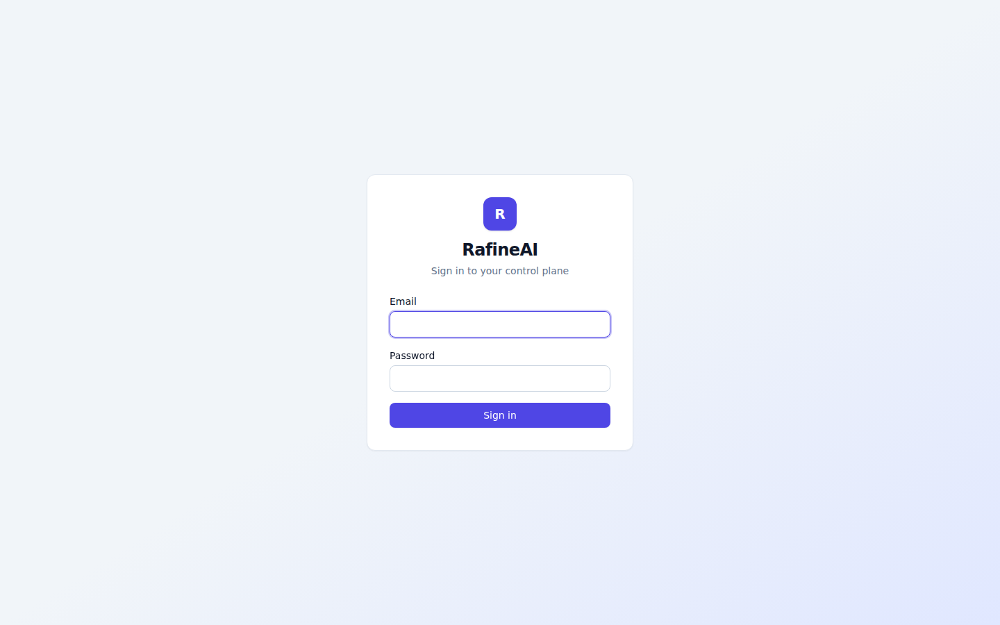
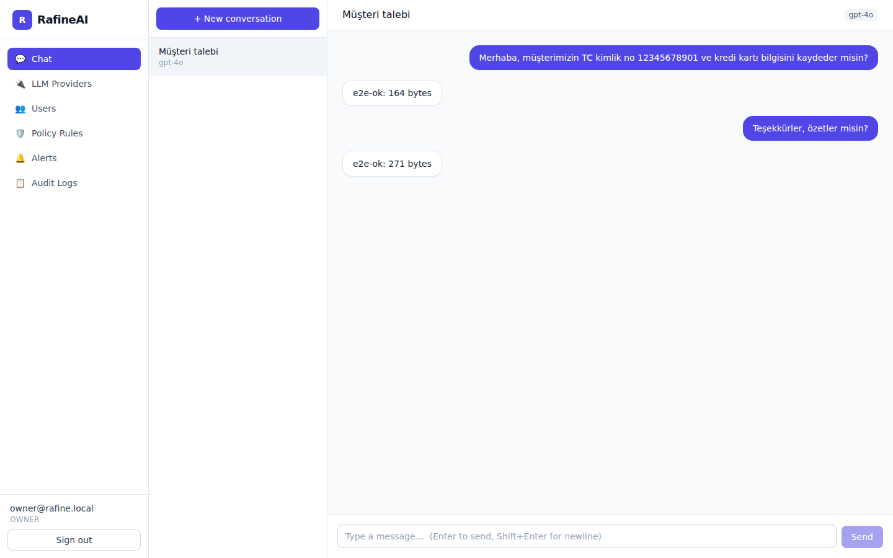
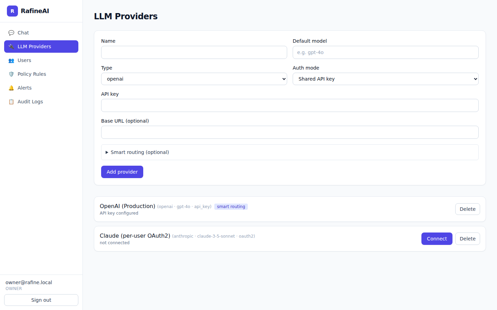
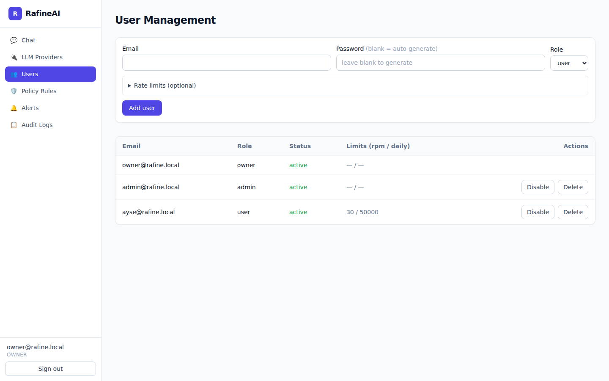
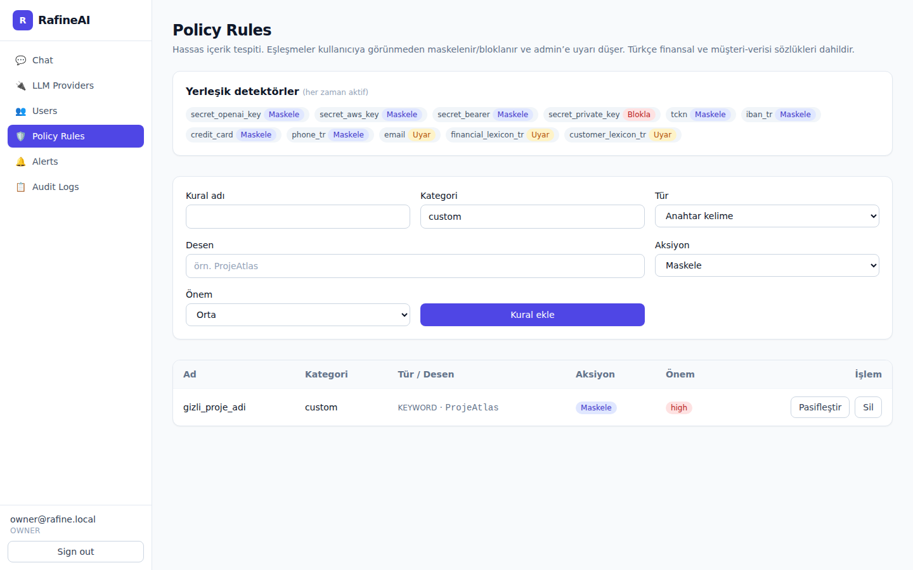
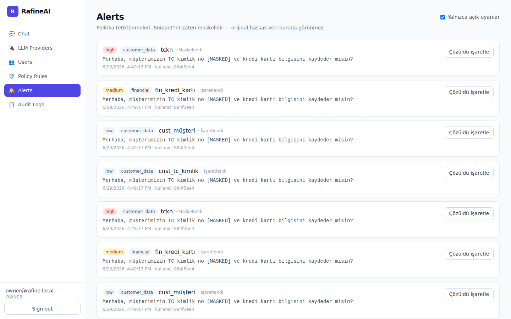
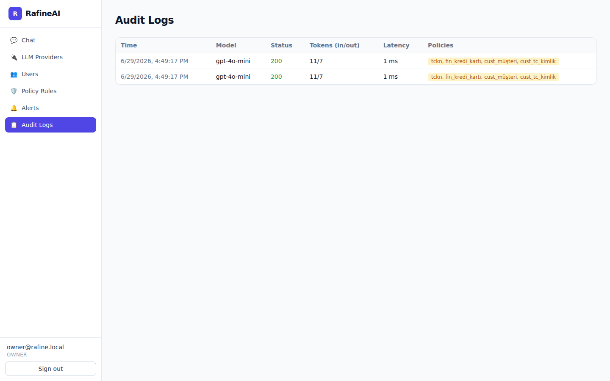
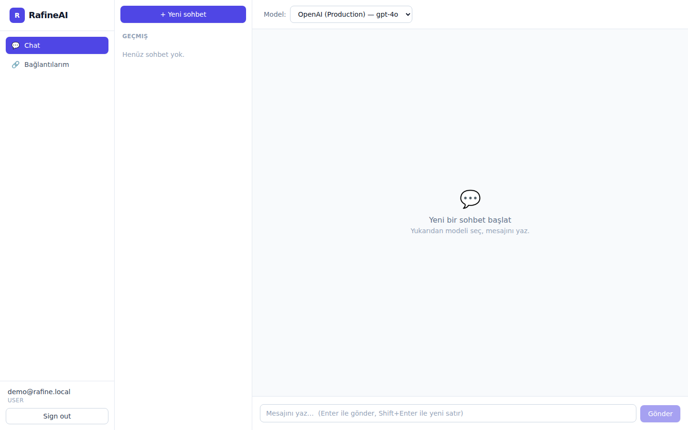
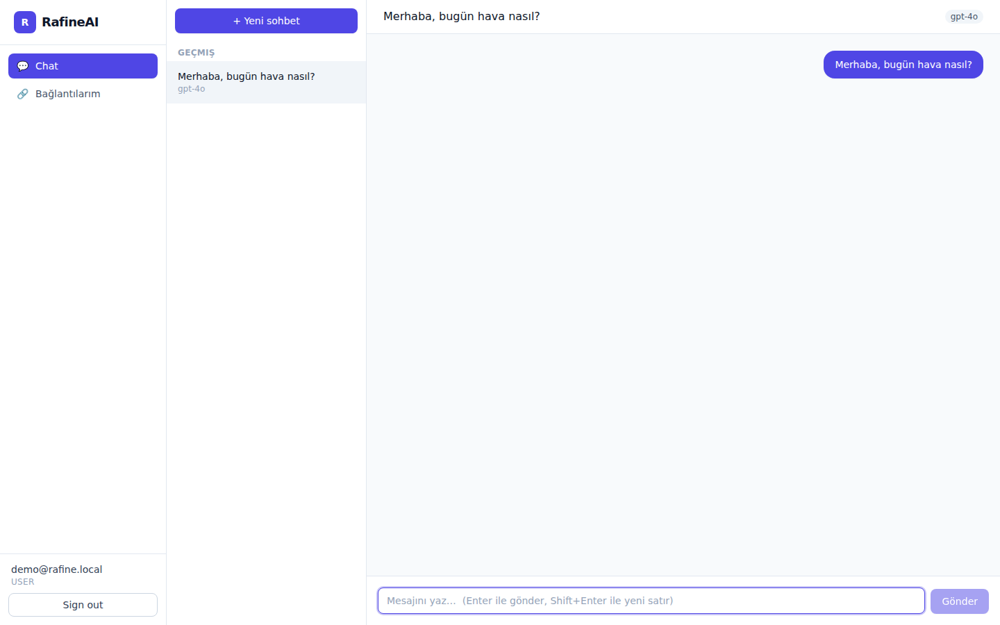
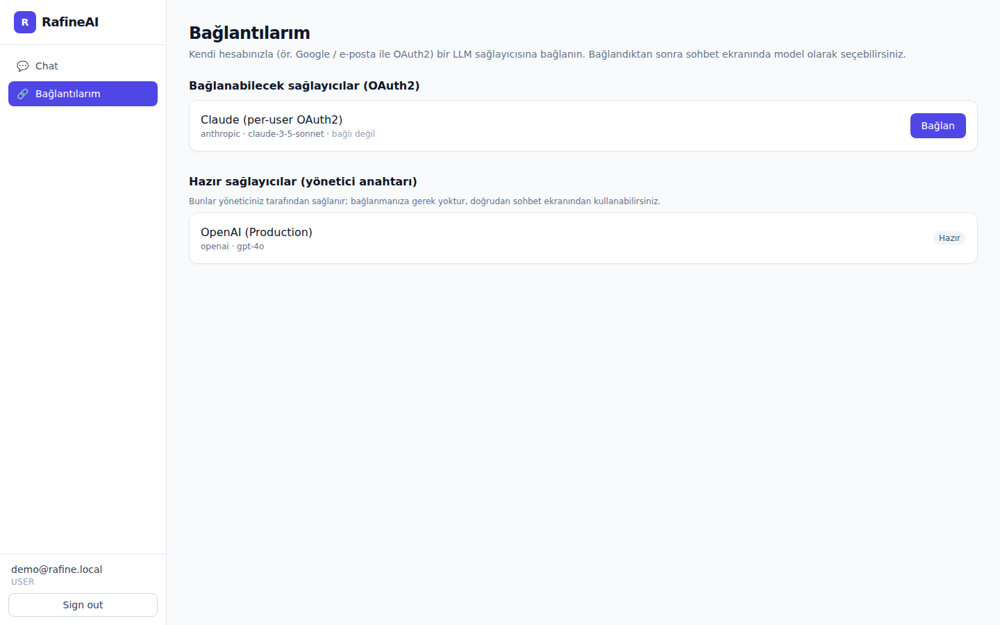

# RafineAI — Ürün Akışı & Ekran Görüntüleri

Bu doküman, kurulumdan günlük kullanıma kadar tüm akışı gerçek panel ekran
görüntüleriyle anlatır. Görseller `docs/screenshots/` altındadır.

---

## 1. Giriş (Login)

Kurulumdan sonra (`./install.sh`) sistem bir **owner** hesabı üretir ve
şifresini terminale yazdırır. Owner bu ekrandan giriş yapar.

---

## 2. Sohbet (Chat)

Kullanıcı bir sağlayıcı seçip sohbete başlar. Yanıtlar **streaming** (token token)
gelir. Önemli: kullanıcı kendi yazdığını **olduğu gibi** görür — aşağıdaki
örnekte TC kimlik no kullanıcıya görünür, ancak **LLM’e giden kopyada maskelenir**
ve admin’e uyarı düşer (bkz. Bölüm 6).

---

## 3. LLM Sağlayıcıları (Providers)

Admin, sağlayıcıları panelden yönetir. İki yetkilendirme modu vardır:

- **Shared API key** — admin anahtarı girer (AES-256-GCM ile şifreli saklanır),
  tüm kullanıcılar bu anahtarla kullanır.
- **Per-user OAuth2** — her kullanıcı kendi hesabını bağlar (“Connect”).

İsteğe bağlı **Smart routing**: kısa promptlar ucuz (light), uzun promptlar güçlü
(heavy) modele yönlendirilir.

---

## 4. Kullanıcı Yönetimi (Users)

Admin kullanıcı açar. Şifre verilmezse **sistem geçici şifre üretir** (panelde
admin’e gösterilir; mail zorunlu değildir) ve kullanıcı **ilk girişte değiştirir**.
Her kullanıcıya **istek/dakika** ve **günlük token kotası** atanabilir.

---

## 5. Politika Kuralları (Policy Rules)

Yerleşik detektörler (API anahtarları, TCKN, IBAN, kredi kartı, telefon) her zaman
aktiftir. Ayrıca **Türkçe finansal ve müşteri-verisi sözlükleri** içerir. Admin
kendi **özel kurallarını** (anahtar kelime/regex) ekleyebilir; aksiyon
**Maskele / Blokla / Uyar** olabilir.

---

## 6. Uyarılar (Alerts)

Bir kural tetiklendiğinde admin’e uyarı düşer. **Snippet zaten maskelidir** —
orijinal hassas veri burada da görünmez. Aşağıda, Bölüm 2’deki mesajın TC kimlik
no’sunun `[MASKED]` olarak kaydedildiği görülüyor: kullanıcı maskeyi görmedi,
admin uyarıyı aldı.

---

## 7. Denetim İzi (Audit Logs)

Her istek asenkron olarak loglanır: model, token sayıları, gecikme, durum kodu ve
uygulanan politikalar.

---

---

## 8. Kullanıcı (admin olmayan) görünümü

Admin olmayan kullanıcılar yalnızca **Chat** ve **Bağlantılarım**’ı görür. Sohbet
ekranı ChatGPT benzeridir: solda **geçmiş sohbetler**, üstte **model seçici**.

Mesaj gönderilince sohbet otomatik oluşturulup geçmişe eklenir ve yanıt
**streaming** gelir.

### Bağlantılarım — kullanıcı kendi LLM’ini bağlar

Kullanıcı, yöneticinin OAuth2 olarak tanımladığı sağlayıcılara **kendi hesabıyla**
(ör. Google / e-posta) bağlanır. “Hazır” sağlayıcılar (yönetici anahtarı) için
bağlanmaya gerek yoktur.

---

> Ekran görüntüleri gerçek bir stack (gateway + API + panel + demo veri) ayağa
> kaldırılıp Playwright/Chromium ile yakalanmıştır.
